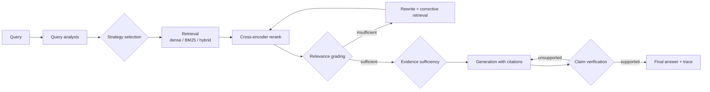

# RAG-Forge

An evaluation-driven adaptive RAG system. RAG-Forge decides per query how much retrieval
and verification is needed, and every technique it uses (BM25, hybrid fusion,
cross-encoder reranking, parent-child retrieval, query rewriting, corrective retrieval, a
Self-RAG-inspired loop, claim verification) can be switched on or off and benchmarked
against a baseline.

> **Status: under active development.** This README grows phase by phase, and it only
> describes what exists in the repository. Benchmark numbers appear only after the
> evaluation pipeline has actually produced them.

## Why this project exists

Most RAG demos run `query → vector search → LLM` and judge quality by eye. RAG-Forge is
built to answer measurable questions instead:

- Does hybrid retrieval beat dense-only on this corpus, and on which query types?
- How much does a cross-encoder reranker add to Recall@5 and MRR, and at what latency cost?
- When does corrective retrieval fire, and does it improve faithfulness enough to justify
  the extra LLM calls?
- What does each quality gain cost in latency, LLM calls and dollars?

## Target pipeline



Every loop has a configurable maximum iteration count, and those counts are capped in
config validation.

## Implementation progress

| Phase | Component | Status |
|---|---|---|
| 1 | Repository, configuration, Docker, DB schema, `/health` | done |
| 2 | Document ingestion + chunking | planned |
| 3 | Baseline dense RAG | planned |
| 4 | Evaluation dataset + retrieval metrics | planned |
| 5–8 | BM25, hybrid (RRF), reranking, parent-child | planned |
| 9–12 | Query rewriting, Corrective RAG, Self-RAG-inspired loop, claim verification | planned |
| 13–18 | Observability, experiment runner, benchmarks, docs, deployment | planned |

## Benchmark results

No experiments have been run yet. All values stay **TBD** until they are produced by
`scripts/run_experiments.py` and recorded under `data/experiments/`.

| System | Recall@5 | MRR | Faithfulness | Answer Relevance | Avg Latency | Cost / query |
|---|---:|---:|---:|---:|---:|---:|
| Dense RAG | TBD | TBD | TBD | TBD | TBD | TBD |
| BM25 | TBD | TBD | TBD | TBD | TBD | TBD |
| Hybrid | TBD | TBD | TBD | TBD | TBD | TBD |
| Hybrid + Reranker | TBD | TBD | TBD | TBD | TBD | TBD |
| Hybrid + Reranker + Rewrite | TBD | TBD | TBD | TBD | TBD | TBD |
| Corrective RAG | TBD | TBD | TBD | TBD | TBD | TBD |
| Self-RAG-inspired | TBD | TBD | TBD | TBD | TBD | TBD |

## Setup

Prerequisites: Docker, and Python 3.12+ for local development.

```bash
cp .env.example .env            # then set ANTHROPIC_API_KEY (or another provider)

# Full stack: PostgreSQL + pgvector and the API (schema is initialized on startup)
docker compose up -d --build
curl localhost:8000/health
```

Local development against the containerized database:

```bash
python3.12 -m venv .venv && source .venv/bin/activate
pip install -e ".[dev]"
docker compose up -d postgres
python scripts/init_db.py
uvicorn app.main:app --reload
```

Postgres is published on host port **5434** by default, to avoid clashing with a local
Postgres on 5432. Override it with `POSTGRES_HOST_PORT`, and keep `DATABASE_URL` in sync.

### Tests

```bash
pytest                    # unit + integration (integration tests skip if Postgres is down)
pytest -m "not integration"
```

Integration tests create and use a separate `ragforge_test` database.

## Configuration

All tunables live in [app/config/settings.py](app/config/settings.py) and are validated at
startup. [.env.example](.env.example) documents every variable. Highlights:

| Variable | Default | Purpose |
|---|---|---|
| `RAG_STRATEGY` | `adaptive` | `baseline`, `dense`, `bm25`, `hybrid`, `hybrid_rerank`, `hybrid_rerank_rewrite`, `corrective`, `self_rag`, `adaptive` |
| `TOP_K` / `RERANK_TOP_K` | 10 / 5 | final context counts |
| `DENSE_WEIGHT` / `BM25_WEIGHT` / `RRF_K` | 0.5 / 0.5 / 60 | fusion |
| `RELEVANCE_THRESHOLD` / `EVIDENCE_THRESHOLD` | 0.65 / 0.70 | corrective and sufficiency gates |
| `MAX_CORRECTIVE_ITERATIONS` / `MAX_SELF_RAG_ITERATIONS` | 2 / 2 | loop caps (validated ≤ 5) |
| `LLM_PROVIDER` | `anthropic` | `anthropic`, `openai_compatible`, `fake` |
| `ENABLE_LANGFUSE` | `false` | tracing (keys are required when enabled) |

Cross-field rules are enforced. For example, `RERANK_TOP_K ≤ RERANK_CANDIDATES ≤
RETRIEVAL_CANDIDATES`, and the fusion weights cannot both be zero.

## Project structure

```
app/
  api/            FastAPI routes
  config/         validated settings
  db/             SQLAlchemy models, session, schema init
  ingestion/      loaders + chunking                (phase 2)
  retrieval/      dense, BM25, hybrid, reranker      (phases 3–8)
  rag/            LangGraph pipeline, nodes, graders (phases 9–12)
  generation/     LLM providers, answer generation   (phase 3)
  evaluation/     datasets, metrics, experiments     (phase 4+)
  observability/  tracing                            (phase 13)
scripts/          CLI entry points (init_db, ingest, eval, experiments)
tests/            unit / integration / evaluation
docs/             technical documentation
data/             raw corpus (gitignored), eval sets, experiment outputs
```

## Documentation

- [docs/architecture.md](docs/architecture.md): system design, data model, key decisions
