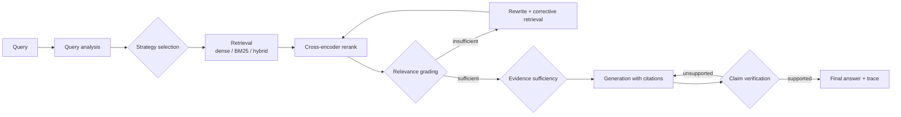

# RAG-Forge

An evaluation-driven adaptive RAG system. RAG-Forge decides per query how much retrieval
and verification is needed, and every technique it uses (BM25, hybrid fusion,
cross-encoder reranking, parent-child retrieval, query rewriting, corrective retrieval, a
Self-RAG-inspired loop, claim verification) can be switched on or off and benchmarked
against a baseline.

> **Status: under active development.** This README grows phase by phase, and it only
> describes what exists in the repository. Benchmark numbers appear only after the
> evaluation pipeline has actually produced them.

## Why this project exists

Most RAG demos run `query → vector search → LLM` and judge quality by eye. RAG-Forge is
built to answer measurable questions instead:

- Does hybrid retrieval beat dense-only on this corpus, and on which query types?
- How much does a cross-encoder reranker add to Recall@5 and MRR, and at what latency cost?
- When does corrective retrieval fire, and does it improve faithfulness enough to justify
  the extra LLM calls?
- What does each quality gain cost in latency, LLM calls and dollars?

## Target pipeline



Every loop has a configurable maximum iteration count, and those counts are capped in
config validation.

## Implementation progress

| Phase | Component | Status |
|---|---|---|
| 1 | Repository, configuration, Docker, DB schema, `/health` | done |
| 2 | Document ingestion (MD/TXT/PDF), structure-aware parent/child chunking, Kubernetes corpus | done |
| 3 | Baseline dense RAG: local embeddings, pgvector search, LLM provider layer, cited answers | done |
| 4 | Evaluation dataset + retrieval metrics | planned |
| 5–8 | BM25, hybrid (RRF), reranking, parent-child | planned |
| 9–12 | Query rewriting, Corrective RAG, Self-RAG-inspired loop, claim verification | planned |
| 13–18 | Observability, experiment runner, benchmarks, docs, deployment | planned |

## Corpus

The evaluation corpus is the **Kubernetes documentation** (`concepts/`, `tasks/` and the
glossary from [kubernetes/website](https://github.com/kubernetes/website)). It is pinned
to commit `5dd61e1` (docs v1.37) and licensed
[CC BY 4.0](https://creativecommons.org/licenses/by/4.0/), © The Kubernetes Authors.
It suits RAG evaluation because it includes:

- factual lookups (defaults, field names)
- keyword-heavy queries (flags, feature gates)
- troubleshooting
- multi-hop questions (e.g. Deployment → ReplicaSet → Pod)
- comparisons (StatefulSet vs Deployment)

Current ingest: 551 documents, 1,044 parent chunks and 3,855 embedded child chunks. See
[docs/ingestion.md](docs/ingestion.md) for chunking design, measurements and limitations.

## Benchmark results

No experiments have been run yet. All values stay **TBD** until they are produced by
`scripts/run_experiments.py` and recorded under `data/experiments/`.

| System | Recall@5 | MRR | Faithfulness | Answer Relevance | Avg Latency | Cost / query |
|---|---:|---:|---:|---:|---:|---:|
| Dense RAG | TBD | TBD | TBD | TBD | TBD | TBD |
| BM25 | TBD | TBD | TBD | TBD | TBD | TBD |
| Hybrid | TBD | TBD | TBD | TBD | TBD | TBD |
| Hybrid + Reranker | TBD | TBD | TBD | TBD | TBD | TBD |
| Hybrid + Reranker + Rewrite | TBD | TBD | TBD | TBD | TBD | TBD |
| Corrective RAG | TBD | TBD | TBD | TBD | TBD | TBD |
| Self-RAG-inspired | TBD | TBD | TBD | TBD | TBD | TBD |

## Setup

Prerequisites: Docker, and Python 3.12+ for local development.

```bash
cp .env.example .env            # defaults work as-is with the local LLM below

# Full stack: PostgreSQL + pgvector and the API (schema is initialized on startup)
docker compose up -d --build
curl localhost:8000/health
```

Start the local LLM (Apple Silicon; free and offline). It runs on the host because MLX
needs the Apple GPU, and the API container reaches it via `host.docker.internal`:

```bash
pip install -e ".[local-llm]"
mlx_lm.server --model mlx-community/Qwen2.5-3B-Instruct-4bit --port 8080
```

Any OpenAI-compatible endpoint works instead (Ollama, vLLM, OpenAI, Groq, Gemini): set
`OPENAI_BASE_URL`, `LLM_MODEL` and, for hosted APIs, `OPENAI_API_KEY`. See
[docs/generation.md](docs/generation.md).

Fetch and ingest the corpus (ingestion embeds every chunk with the local embedder):

```bash
python scripts/fetch_corpus.py                 # pinned sparse checkout into data/raw/
EMBEDDING_DEVICE=mps python scripts/ingest.py --corpus kubernetes   # idempotent
python scripts/ingest.py --path ./my-docs      # or any folder of .md / .txt / .pdf
```

Local development against the containerized database:

```bash
python3.12 -m venv .venv && source .venv/bin/activate
pip install -e ".[dev]"
docker compose up -d postgres
python scripts/init_db.py
uvicorn app.main:app --reload
```

Postgres is published on host port **5434** by default, to avoid clashing with a local
Postgres on 5432. Override it with `POSTGRES_HOST_PORT`, and keep `DATABASE_URL` in sync.

### Tests

```bash
pytest                    # unit + integration (integration tests skip if Postgres is down)
pytest -m "not integration"
```

Integration tests create and use a separate `ragforge_test` database.

## API

| Method | Path | Purpose |
|---|---|---|
| `GET` | `/health` | database and pgvector status |
| `POST` | `/documents/ingest` | multipart upload of `.md` / `.txt` / `.pdf` files (≤20 files, ≤20 MB each), with per-file status |
| `GET` | `/documents` | list ingested documents with chunk counts and source URLs |
| `POST` | `/query` | answer a question with citations, timings and token usage |

```bash
curl -X POST localhost:8000/documents/ingest -F "files=@runbook.md" -F "files=@manual.pdf"
```

Each file succeeds or fails independently: unsupported types, corrupt PDFs and empty files
are reported per file instead of failing the whole request.

```bash
curl -X POST localhost:8000/query -H 'content-type: application/json' \
  -d '{"query": "What is the default termination grace period for a Pod?", "top_k": 5}'
```

Response from the running system (local Qwen 3B), abridged:

```json
{
  "answer": "The default termination grace period for a Pod is 30 seconds [1].",
  "abstained": false,
  "sources": ["[1] Pod Lifecycle > Termination of Pods > Pod Termination Flow"],
  "citations": [{"number": 1, "chunk_id": "doc_…:c…", "url": "https://kubernetes.io/docs/concepts/workloads/pods/pod-lifecycle/", "…": "…"}],
  "retrieval_strategy": "baseline",
  "retrieval_iterations": 1,
  "evidence_score": null,
  "faithfulness_score": null,
  "timings": {"retrieval_s": 0.14, "generation_s": 19.13, "total_s": 19.27},
  "usage": {"llm_calls": 1, "input_tokens": 1625, "output_tokens": 17, "estimated_cost_usd": 0.0}
}
```

`evidence_score` and `faithfulness_score` stay `null` until the grading and verification
phases. Unimplemented strategies return HTTP 501 instead of silently falling back.

## Configuration

All tunables live in [app/config/settings.py](app/config/settings.py) and are validated at
startup. [.env.example](.env.example) documents every variable. Highlights:

| Variable | Default | Purpose |
|---|---|---|
| `RAG_STRATEGY` | `baseline` | `baseline`, `dense`, `bm25`, `hybrid`, `hybrid_rerank`, `hybrid_rerank_rewrite`, `corrective`, `self_rag`, `adaptive` |
| `TOP_K` / `RERANK_TOP_K` | 10 / 5 | final context counts |
| `CHILD_CHUNK_SIZE` / `CHILD_CHUNK_OVERLAP` / `PARENT_CHUNK_SIZE` | 360 / 60 / 1600 | chunking (calibrated approximate tokens) |
| `EMBEDDING_MODEL` / `EMBEDDING_INCLUDE_CONTEXT` | `BAAI/bge-small-en-v1.5` / `true` | local embedder; embed chunks with their title and section path |
| `DENSE_WEIGHT` / `BM25_WEIGHT` / `RRF_K` | 0.5 / 0.5 / 60 | fusion |
| `RELEVANCE_THRESHOLD` / `EVIDENCE_THRESHOLD` | 0.65 / 0.70 | corrective and sufficiency gates |
| `MAX_CORRECTIVE_ITERATIONS` / `MAX_SELF_RAG_ITERATIONS` | 2 / 2 | loop caps (validated ≤ 5) |
| `LLM_PROVIDER` / `OPENAI_BASE_URL` / `LLM_MODEL` | `openai_compatible` / local MLX / Qwen2.5-3B-Instruct-4bit | any OpenAI-compatible endpoint, or `fake` |
| `LLM_PRICING` | `{}` | USD per 1M tokens per model; unlisted non-local models are reported as unpriced |
| `ENABLE_LANGFUSE` | `false` | tracing (keys are required when enabled) |

Cross-field rules are enforced. For example, `RERANK_TOP_K ≤ RERANK_CANDIDATES ≤
RETRIEVAL_CANDIDATES`, and the fusion weights cannot both be zero.

## Project structure

```
app/
  api/            FastAPI routes
  config/         validated settings
  db/             SQLAlchemy models, session, schema init
  ingestion/      loaders, Hugo preprocessing, parent/child chunking, pipeline
  retrieval/      retriever interface, embeddings, dense (pgvector); BM25/hybrid/rerank next
  rag/            strategies (baseline), prompts; graph/graders in phases 9–12
  generation/     LLM provider layer, structured output, citations, usage/cost
  evaluation/     datasets, metrics, experiments     (phase 4+)
  observability/  tracing                            (phase 13)
scripts/          CLI entry points (init_db, ingest, eval, experiments)
tests/            unit / integration / evaluation
docs/             technical documentation
data/             corpus manifest, raw corpus (gitignored), eval sets, experiment outputs
```

## Documentation

- [docs/architecture.md](docs/architecture.md): system design, data model, key decisions
- [docs/ingestion.md](docs/ingestion.md): loaders, chunking algorithm, corpus, measurements
- [docs/retrieval.md](docs/retrieval.md): retriever interface, dense retrieval, pgvector pitfalls
- [docs/generation.md](docs/generation.md): LLM providers, local model, prompts, citations, baseline
