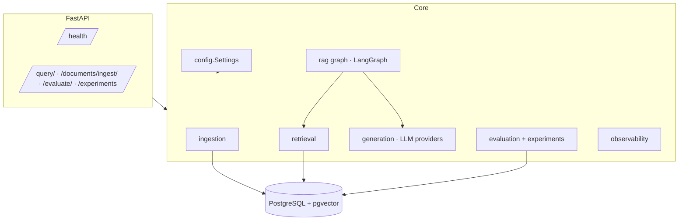
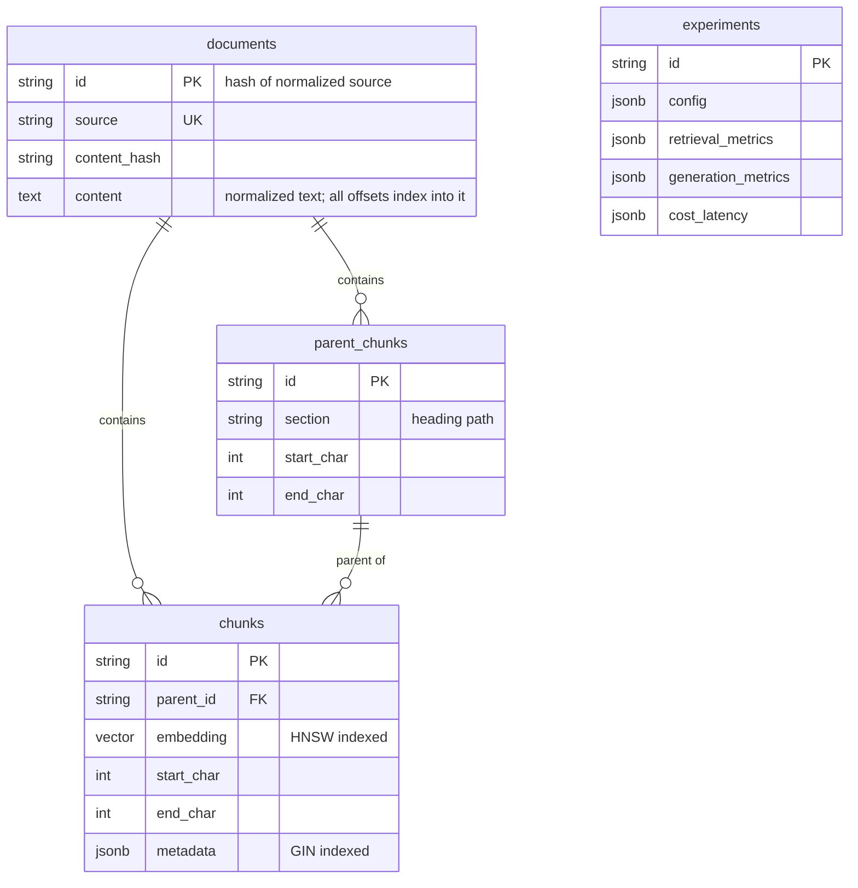

# Architecture

This document records RAG-Forge's system design and the reasoning behind its structural
decisions. It is updated as each phase lands, and sections marked *(planned)* describe
design intent that has no implementation yet.

## Goals and non-goals

**Goals:** every retrieval and generation technique is independently switchable and
measurable; results are reproducible from a recorded configuration; the system exposes
*why* it made each decision (strategy chosen, corrective retrieval triggered, claim
unsupported), but never raw chain-of-thought.

**Non-goals:** microservices, a rich frontend, or a faithful reproduction of any research
paper. The corrective and Self-RAG-style components are practical adaptations, and they
are documented as such.

## Components

## Configuration model

A single `Settings` object is composed of groups: `database`, `embedding`, `chunking`,
`retrieval`, `adaptive`, `llm` and `observability`. Env var names stay flat (`TOP_K`, not
`RETRIEVAL__TOP_K`) so `.env` files remain readable.

Design rules:

- **No hardcoded thresholds.** Graders and nodes receive thresholds from settings. The
  experiment runner builds a `Settings` per experiment, which is only possible if nothing
  reads constants directly.
- **Validation at load time.** Includes ranges (thresholds in [0, 1]), hard loop caps
  (iterations ≤ 5, so a typo cannot create a runaway loop), and cross-field constraints
  (`RERANK_TOP_K ≤ RERANK_CANDIDATES ≤ RETRIEVAL_CANDIDATES`).
- **Secrets are checked lazily.** API keys are validated when a provider client is built,
  not at import. Tests and offline tooling therefore run without secrets, while a
  misconfigured production run still fails fast on its first LLM use.
- **`Settings.snapshot()`** gives a secret-free dump that is stored with every experiment.

## Data model

### Decisions

**Character offsets on every chunk.** Evaluation labels are anchored to evidence spans in
the source document rather than to chunk IDs. If labels were chunk IDs, every chunking
experiment would invalidate the evaluation set. With spans, chunk relevance is recomputed
for each experiment by overlap, which makes chunking itself a benchmarkable variable.

**Full document text is stored.** `documents.content` holds the normalized text that every
chunk offset points into. It roughly doubles text storage, which is trivial at this corpus
size (about 4 MB). In return, evaluation can resolve evidence spans and recompute chunk
relevance for any chunking configuration, without re-reading source files.

**Deterministic document IDs.** IDs are derived from the normalized source path. This makes
re-ingestion an idempotent upsert and keeps dataset references stable.

**pgvector with HNSW.** Vectors live in the same transactional store as their metadata, so
metadata filtering is a plain `WHERE` clause and no second system needs to stay in sync.
The HNSW operator class must match the query operator, so the index is created for the
configured `SIMILARITY_METRIC`. Changing the metric requires re-initialization.

**Fixed embedding dimension.** `vector(EMBEDDING_DIM)` is fixed when the schema is
created. Switching to a model with a different dimension means re-creating the table and
re-embedding. This is an accepted cost: mixed-dimension storage would complicate every
query to support a rare operation.

**BM25 is not Postgres full-text search.** `ts_rank` is not BM25: it has no IDF saturation
and no length normalization of the same form. BM25 will be a separate in-process index
built from the `chunks` table, so the "BM25" row in the benchmarks really is BM25.
*(planned: phase 5)*

**Synchronous DB access.** The expensive operations (embedding, reranking, BM25 scoring)
are CPU-bound, so async I/O would add complexity with little throughput benefit at this
scale. FastAPI runs sync endpoints in a threadpool.

## Ingestion

See [ingestion.md](ingestion.md). In summary: loaders normalize text; a corpus-specific
preprocessor (Hugo shortcodes for the Kubernetes docs) resolves template syntax; the
structure-aware chunker emits parent and child *offsets*; the pipeline upserts idempotently,
keyed on a fingerprint of content, chunker config and embedding model.

## LLM providers

See [generation.md](generation.md). There is one provider-neutral interface
(`LLMClient.complete`) and one real implementation: an OpenAI-compatible HTTP client.
That covers local servers (MLX by default, plus Ollama and vLLM) and hosted APIs. A
provider-specific SDK integration is left out deliberately until there is a key to test it
with; untested integrations are not shipped.

The default generator, grader and judge is a local 3B model, chosen so the whole system
runs free and offline on an 8 GB M1. Every generation metric is therefore reported
together with the model that produced it, and strategies are compared under the same
generator and judge.

## Deployment

`docker compose up` starts `pgvector/pgvector:pg16` and the API. The API container runs the
idempotent schema init, then uvicorn. Model weights are cached in a named volume
(`HF_HOME=/models`), so the embedder and reranker download once. The image installs
CPU-only torch wheels to keep its size manageable.

## Limitations (current)

- No schema migration tool yet. `init_db` creates missing objects but does not alter
  existing ones. Alembic will be added once the schema stops changing every phase.
- The embedding dimension is bound at import time from settings. Tests assume the default
  (384).
