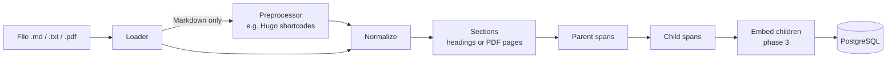

# Ingestion and chunking

How files become `documents`, `parent_chunks` and `chunks` rows, and why chunking works
the way it does.

## Pipeline



| Stage | Module | Output |
|---|---|---|
| Load | [app/ingestion/loaders.py](../app/ingestion/loaders.py) | `LoadedDocument`: normalized text, sections, metadata |
| Markdown parsing | [app/ingestion/markdown.py](../app/ingestion/markdown.py) | front matter, heading-path sections (code fences ignored) |
| Corpus preprocessing | [app/ingestion/hugo.py](../app/ingestion/hugo.py) | Hugo shortcodes resolved to reader-visible text |
| Chunking | [app/ingestion/chunking.py](../app/ingestion/chunking.py) | parent and child spans (offsets only) |
| Persistence | [app/ingestion/pipeline.py](../app/ingestion/pipeline.py) | idempotent upsert of rows |

## Core invariant: chunks are offsets, not copies

Loaders produce one normalized text per document, stored in `documents.content`.
Chunkers only choose boundaries: every parent and child is `content[start:end]`, and
nothing is rewritten. This matters for three reasons:

1. **Evaluation labels survive re-chunking.** Eval questions will reference evidence
   *spans* in `documents.content`. Chunk relevance is computed by span overlap, so
   chunk size becomes an experiment variable instead of something that invalidates the
   dataset.
2. **Citations are exact.** A cited chunk can be highlighted in its source document.
3. **It can be verified mechanically.** On the current corpus, the check
   `substring(content, start, len) = text` returns 0 mismatches across all 3,062 chunks.

## Supported formats

| Format | Sections | Page numbers | Notes |
|---|---|---|---|
| Markdown | ATX headings, with full heading path | – | YAML front matter gives the title and description; `{#anchor}` suffixes and HTML comments are stripped |
| TXT | whole document | – | line endings and blank-line runs normalized |
| PDF | one per page | yes | `pypdf` text extraction; blank pages skipped but page numbering kept |

Headings are not detected in PDFs: text extraction loses font information, and guessing
headings from line lengths is unreliable. Pages are the structural unit instead, and every
PDF chunk is citable by page.

Errors are per file. `UnsupportedFileTypeError`, `DocumentParseError` (corrupt PDF,
non-UTF-8 text) and `EmptyDocumentError` skip one file without aborting a batch. Each file
commits in its own transaction.

## Chunking

Sizes are in *approximate* tokens (see [Token estimation](#token-estimation)). The
defaults are `CHILD_CHUNK_SIZE=400`, `CHILD_CHUNK_OVERLAP=60` and
`PARENT_CHUNK_SIZE=1600`.

### Units

A document region is first cut into **blocks**:

- paragraphs, separated by blank lines
- fenced code blocks, which are one block even if they contain blank lines
- heading lines, which are glued to the block after them, so there are no heading-only chunks

A block larger than the target size is split, in this order of preference:

1. sentences, or lines for code
2. whitespace-separated word windows
3. character slices, for whitespace-free runs such as base64 blobs

The result is that **no chunk ever exceeds its configured limit**.

Sentence splitting deliberately does **not** treat a bare newline as a boundary. The
Kubernetes Markdown source is hard-wrapped, and splitting on newlines produced chunks that
began mid-sentence. The splitter breaks after `.`, `!` or `?`, after a line-ending colon,
or before a list item.

### Parents

Consecutive heading sections are merged while they fit in `PARENT_CHUNK_SIZE`, and never
across PDF pages. A section larger than the limit is split at block boundaries. Each parent
records the labels of all the sections it contains.

*Design note, measured on the Kubernetes corpus:* the first version refused to merge
across top-level (H2) sections, to keep parents topically tight. Kubernetes pages have many
short H2 sections, so **50.1% of children were identical to their parent**, and
parent-child retrieval would have added no context for them. After allowing merges across
H2 boundaries, that figure is **8.0%** and the median parent is 3.8× its child.

### Children

Units are packed greedily up to `CHILD_CHUNK_SIZE` inside each parent, so a child never
straddles two parents. Each new child starts with up to `CHILD_CHUNK_OVERLAP` tokens of
trailing context from the previous one. That context is whole units if they fit, otherwise
trailing sentences. Overlap is best-effort and always sentence-aligned, and code blocks are
never used as partial overlap.

### Idempotency and re-chunking

Each document stores a fingerprint of:

- its content hash
- the chunker version and configuration
- the embedding model

Re-running ingestion with nothing changed is a no-op (`unchanged`). Changing any chunking
setting, or bumping `CHUNKER_VERSION`, rebuilds only the affected documents' chunks.

### Token estimation

`estimate_tokens` counts word and punctuation pieces, with long runs counted as
`1 + (len - 1) // 10` tokens. It is model-independent on purpose, so changing the
embedding model does not move chunk boundaries. Counting long runs matters because a naive
count treats a 5,000-character identifier or base64 string as a single token. Chunks like
that would exceed the embedder's input limit and be silently truncated. How far this proxy
drifts from the real embedding tokenizer is measured in phase 3.

## Kubernetes corpus

| | |
|---|---|
| Source | [kubernetes/website](https://github.com/kubernetes/website), `content/en/docs` |
| Pinned commit | `5dd61e17b222c0220281657b843a3e15c86b3cfe` (2026-09-23), docs version v1.37 |
| Subpaths | `concepts/`, `tasks/`, `reference/glossary/` |
| License | [CC BY 4.0](https://creativecommons.org/licenses/by/4.0/), © The Kubernetes Authors |
| Manifest | [data/corpus/kubernetes/manifest.json](../data/corpus/kubernetes/manifest.json), with a sha256 for every file |

```bash
python scripts/fetch_corpus.py             # shallow sparse checkout -> data/raw/ (gitignored)
python scripts/ingest.py --corpus kubernetes
```

Current ingest, with default chunking and no embeddings yet:

| Category | Documents | Child chunks | Avg child tokens |
|---|---:|---:|---:|
| concepts | 185 | 1,628 | 323 |
| tasks | 204 | 1,271 | 323 |
| reference (glossary) | 162 | 163 | 87 |
| **Total** | **551** | **3,062** | |

There are 947 parent chunks, with a median of 1,093 tokens. Nineteen `_index.md` listing
pages contain no prose and are skipped. A full ingest takes about 5 s; a no-op re-run takes
about 1.6 s.

### Hugo shortcode handling

The docs use Hugo shortcodes heavily: 744 `glossary_tooltip`, 585 `note`, 354
`feature-state` and 277 `code_sample` in `concepts/` and `tasks/`. Indexed raw, BM25 and
the embedder would match template syntax instead of prose. `HugoShortcodeResolver`
approximates what a reader sees:

| Shortcode | Becomes |
|---|---|
| `glossary_tooltip` | its `text`, or the glossary term's title |
| `glossary_definition` | the glossary definition, with nested shortcodes resolved (depth-limited) |
| `skew currentVersion`, `param "version"` | `1.37`, `v1.37` |
| `feature-state` | `FEATURE STATE: Kubernetes v1.29 [stable]` |
| `note` / `caution` / `warning` | `Note:` / `Caution:` / `Warning:`, content kept |
| `code_sample file=...` | `(Example manifest: <file>)` |
| `include`, `version-check`, `thirdparty-content` | removed (boilerplate) |
| `comment`, `mermaid` blocks | removed with their content |
| anything else | tag stripped, inner content kept; the name is logged |

After ingestion, **0 of 3,062 chunks contain shortcode syntax**, and no shortcode names go
unhandled.

## Limitations

- **Code samples are not inlined.** `code_sample` references manifests under
  `content/en/examples/`, which is not part of the checkout. Questions whose answers exist
  only inside those YAML files are not answerable from this corpus. The evaluation set
  must account for this.
- **`feature_gate_name` states are not resolved.** Hugo looks the stage and version up in
  site data. We emit only the gate name.
- **PDF extraction quality depends on the PDF.** There is no OCR for scanned documents,
  and no table-structure recovery.
- **Markdown links are kept verbatim** (`[text](/docs/...)`). URL tokens add some noise
  to BM25 and embeddings. Whether stripping them helps is an empirical question for the
  retrieval experiments.
- **Uploads are keyed by filename** (`upload://<name>`). Uploading a different file with
  the same name replaces the earlier document.
